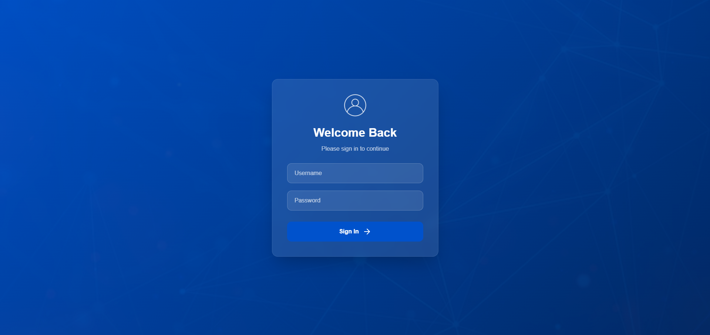
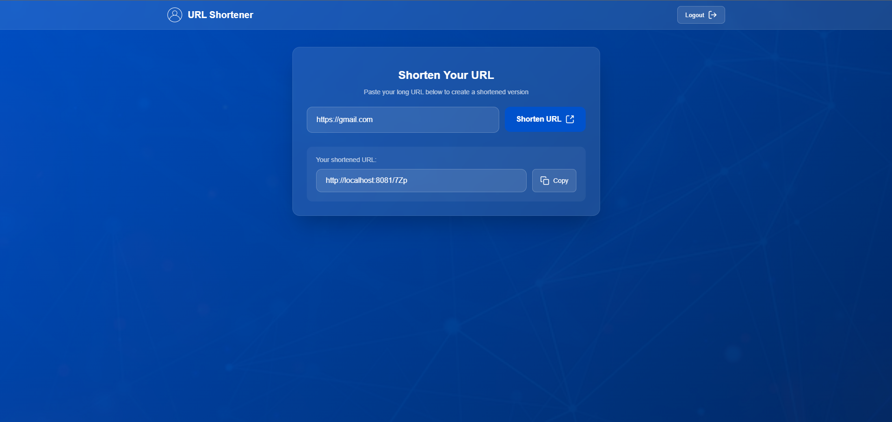

# URL Shortener

A simple URL shortener application built with Java, Spring Boot, and Vue.js.




## Features

- Shorten long URLs
- Redirect to original URLs
- Track URL usage statistics

## Technologies Used

- Java
- Spring Boot
- Gradle
- JavaScript
- Vue.js
- npm

## Getting Started

### Prerequisites

- Java 11 or higher
- Node.js and npm
- Gradle

### Installation

1. Clone the repository:
    ```sh
    git clone https://github.com/your-username/url-shortener.git
    cd url-shortener
    ```

2. Set up the backend:
    ```sh
    cd backend
    ./gradlew build
    ```

3. Set up the frontend:
    ```sh
    cd ../frontend
    npm install
    npm run build
    ```

### Running the Application

1. Start the backend server:
    ```sh
    cd backend
    ./gradlew bootRun
    ```

2. Start the frontend development server:
    ```sh
    cd ../frontend
    npm run serve
    ```

3. Open your browser and navigate to `http://localhost:8080`.

## Configuration

Create a `.env` file in the root directory and add the necessary environment variables.

## Contributing

1. Fork the repository
2. Create a new branch (`git checkout -b feature/your-feature`)
3. Commit your changes (`git commit -m 'Add some feature'`)
4. Push to the branch (`git push origin feature/your-feature`)
5. Open a pull request

## License

This project is licensed under the MIT License - see the [LICENSE](LICENSE) file for details.